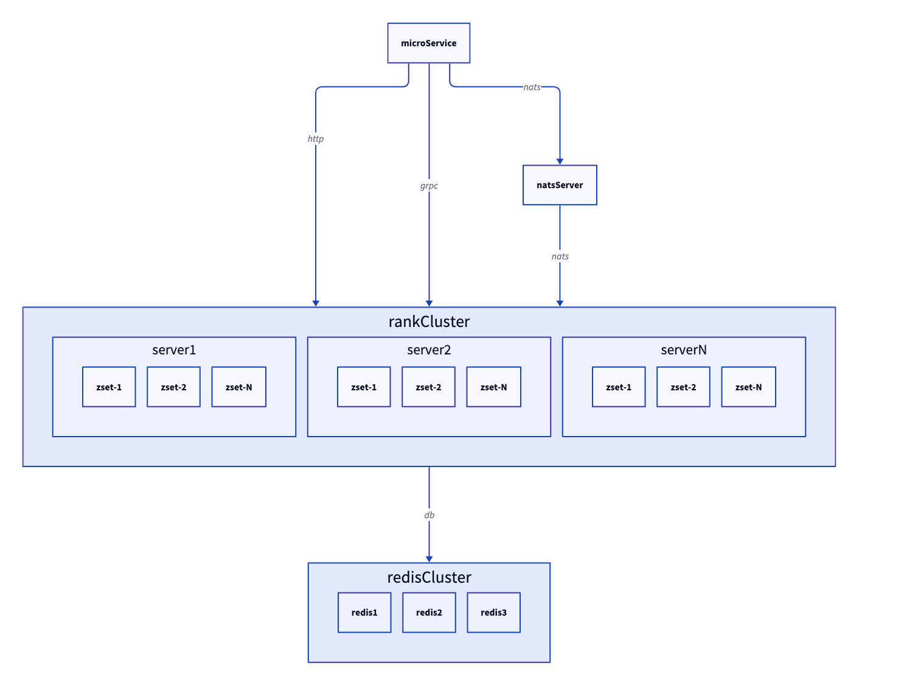

# rankserver

排行榜服务，纯内存实现，数据结构采用跳表，通信框架采用natsrpc，基于动态配置可扩可缩

## 架构图



## 项目亮点

1. 纯内存实现，数据结构采用跳表，读写直接操作内存数据，异步落地
2. 采用多路复用+cpu运算单协程模式，避免竞态问题，无锁编程，开发效率高
3. 采用动态+静态配置结合的方式，让服务可以以无状态形式部署以有状态形式运行，方便扩容缩容
4. 采用natsrpc的通信模式，基于topic的形式，方便调用接口
5. 容易横向扩容，基于动态配置，启服决定该服务服务于哪些ranktype，可以做到不同的rankserver监听不同的ranktype，多ranktype横向扩容
6. 同一份逻辑实现，可支持不同协议入口，

## 依赖库

1. https://github.com/liuwangchen/toy 库代码仓库，包含natsrpc通信框架和一些基础组件代码
2. https://github.com/liuwangchen/apis 协议仓库，用来放协议文件，调用者只需要引协议库即可调用rankserver

## 入口

main.go启动 -> 基于nats注册service.go实现类 -> 协议进来调用logic包内排行榜逻辑

## 协议
```
// 排行榜返回item
message RankItem {
  string id = 1; // 各种id：玩家id，联盟id，服务器id等等
  int64 score = 2; // 积分
  uint32 rank = 3;
  int64 then = 4; // 二级排序值
}

// 请求排行榜
message ReqGetRank {
  int32 rankType = 1; // 请求的排行榜类型
  uint32 beginRank = 2; // 排行榜初始名次
  uint32 count = 3; // 数量
  string me = 4;
  bool reverse = 5; // 是否反转
}

// 请求排行榜，请求me前后offset名次的数据
message ReqGetRankByOffset {
  int32 rankType = 1; // 请求的排行榜类型
  string me = 2;
  int32 offset = 3; // 偏移
  bool reverse = 4; // 是否反转
}

message RspGetRank {
  ret.RET code = 1;
  repeated RankItem ranks = 2;
  RankItem me = 3; // meUid>0时候返回
  RankItem top = 4; // withTop1=true时候返回
  uint32 totalRankNum = 5; // 总上榜人数
}

message RankChangeData {
  int64 score = 1;
  int64 then = 2;
}

// 更新排行榜，替换形式
message ReqUpdateRank {
  int32 rankType = 1; // 排行榜类型
  map<string, RankChangeData> rankData = 2; // 更新的数据，id -> score，增量的
}

message ReqDeleteRankMems {
  int32 rankType = 1; // 排行榜类型
  repeated string mems = 2; // 要删除的成员
}

message ReqDeleteRank {
  int32 rankType = 1; // 排行榜类型
}

message CommonRsp {
  ret.RET code = 1;
}

service RankServer {
  option (rpc.serviceAsync) = true;
  // 获取排行榜
  rpc GetRank (ReqGetRank) returns (RspGetRank) {}

  // 获取me前后offset名次排行榜
  rpc GetRankByOffset (ReqGetRankByOffset) returns (RspGetRank) {}

  // 更新排行榜
  rpc UpdateRank (ReqUpdateRank) returns (CommonRsp) {}

  // 删除排行榜成员
  rpc DeleteRankMems (ReqDeleteRankMems) returns (CommonRsp) {}

  // 删除排行榜
  rpc DeleteRank (ReqDeleteRankMems) returns (CommonRsp) {}
}

```

## 测试

```http
###
POST http://localhost:8080/rankserver.RankServer/GetRank?name=get HTTP/1.1
Content-Type: application/json

{
  "rankType" : 1,
  "beginRank" : 1,
  "count" : 10
}

###
POST http://localhost:8080/rankserver.RankServer/GetRankByOffset?name=get HTTP/1.1
Content-Type: application/json

{
  "rankType" : 1,
  "me" : "456",
  "offset" :0
}


###
POST http://localhost:8080/rankserver.RankServer/UpdateRank?name=update HTTP/1.1
Content-Type: application/json

{
  "rankType" : 1,
  "rankData" : {
      "123":{
          "score":1234
      },
      "456":{
          "score":456
      }
  }
}

###
POST http://localhost:8080/rankserver.RankServer/DeleteRankMems?name=delMem HTTP/1.1
Content-Type: application/json

{
  "rankType" : 1,
  "mems": ["123","456"]
}

###
POST http://localhost:8080/rankserver.RankServer/DeleteRank?name=delRank HTTP/1.1
Content-Type: application/json

{
  "rankType" : 1
}
```
